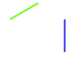

# Shady

`shady` is an intermediate language and compiler for research purposes. Shady supports GPU programs through features such as local uniformity analysis, structured control-flow and a close mapping to and from SPIR-V.

The IR is composed of mostly immutable structural nodes, with a sprinkling of nominal mutable nodes for things like functions and global variables. Many optimizations are implemented as build-type folding operations see [`fold.c`](src/shady/fold.c) using simple local analysis. More complex passes are implemented as [rewriters](include/shady/rewrite.h) and pass ordering is controlled by compilation [pipelines](include/shady/pipeline/pipeline.h).

Most of the IR grammar is defined in [json](include/shady/grammar.json) files, [Python scripts](src/generator/) then generate much of the boilerplate code (node hashing, rewriting, visitors, ...). Additional headers are found in the [include/shady/ir](include/shady/ir/) folder. We occasionally use x-macros as "rich" enums.

Shady is used as part of the [AnyDSL](https://anydsl.github.io) to provide experimental Vulkan accelerator support.

## Vcc - the Vulkan Clang Compiler

Shady features a front-end called Vcc that calls into Clang and parses the resulting LLVM IR, giving you effectively a C/C++ to SPIR-V compiler. Vcc currently does live in this repository, inside `src/frontends/llvm` and `src/driver/vcc.c`.

This might change later to keep the IR issues tracked separately. Please check out the [Vcc website](https://shady-gang.github.io/vcc) if you have not already.

## `shader-pipeline` Feature support

Shady was built for emulating a better programming model on top of Vulkan shaders, and this remains the primary use-case. The [`shader-pipeline`](src/shader-pipeline/) directory contains the source code for this lowering pipeline.
Note that most passes live in the main `shady` folder, even if they are currently only used in the `shader-pipeline` pipeline.

Not all supported features are listed, these are just the more notable ones that are either already working, or are planned.

 * [x] True function calls (thanks to a CPS transformation)
   * Function pointers/indirect calls
   * Recursion (with a stack)
   * Divergent calls
 * [x] Arbitrary control flow inside functions: `goto`, including non-uniform is allowed
   * This makes `shady` easy to target from existing compilers.
   * Reconvergence is explicit and dataflow driven, not reliant on a CFG analysis.
 * [x] Subgroup memory (known as `simdgroup` in Metal)
 * [x] Physical pointers (cast-able pointers where the layout of objects in memory is observable)
   * [x] For 'private' memory
   * [x] For 'shared' memory
 * 'Wide' subgroup operations (with arbitrary types)
   * [x] Ballot
   * [ ] Shuffles
 * [ ] Int8, Int16 and Int64 support everywhere
 * [ ] FP 64 emulation
 * [x] Generic (tagged) pointers
 * [x] Printf debug support
 * [x] Adapt code generation to the target through a `runtime` component.

## Platform support

Shady is written in standard C11 and requires few dependencies to build: SPIRV-Headers and SPIRV-Tools are pulled as submodules,
LLVM is required to build Vcc, Vulkan and CUDA are optional dependencies for the runner component.

 * Compiles on Windows/MacOS/Linux with any C11 compliant toolchain: GCC, Clang and recent versions of MSVC
   * Windows SDKs older than 10.0.20348.0 are missing important C11 features and are unsupported.
   * Will run as far back as [Windows XP](https://mastodon.gamedev.place/@gob/109580697549344123) - using MinGW based toolchains.
   * We ran the compiler on IA32, AMD64, AArch64 and RISCV 64 machines with no issues.
 * The following Vulkan drivers have been tested:
   * [x] `radv` Open-source mesa driver for AMD GPUs
     * Tested on multiple RDNA2 and GCN devices
   * [x] `amdvlk` works too
   * [x] `anv` Open-source mesa driver for Intel GPUs
   * [x] Intel proprietary Windows drivers (UHD 630, A750/A770)
   * [x] NVidia proprietary drivers (requiring a [small hack](https://github.com/Hugobros3/shady/commit/f3ef83dbff7f29654fc11f8901ba67494864c085))
   * [ ] MoltenVK does not work properly due to issues with SPIRV-Cross
   * [ ] Imagination closed-source driver on the VisionFive 2 board: driver crash

Additionally, the compiler supports alternative backends:
 * GLSL (untested - no runtime component yet)
 * ISPC (no runtime component either, but useful for debugging on the host)

Metal shading language and C backends are on the table in the future.
