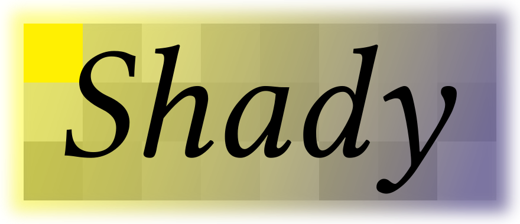

# Shady



`shady` is a small intermediate shading language and compiler for research purposes. It strives to be a testbed for improved GPU programming models, and also provide support for emulating features either missing from SPIR-V, or suffering from poor support.

Shady is ideal for projects that aim to target SPIR-V, but already make use of features that are not found in vanilla Vulkan compute. See feature support below.

Shady is used as part of the [AnyDSL](https://anydsl.github.io) to provide experimental Vulkan accelerator support.

## Vcc - the Vulkan Clang Compiler

Shady features a front-end called Vcc that calls into Clang and parses the resulting LLVM IR, giving you effectively a C/C++ to SPIR-V compiler.

This project is called 'Shady' and is the IR/middle-end part of Vcc. Vcc currently does live in this repository, inside `src/frontends/llvm` and `src/driver/vcc.c`.

This might change later to keep the IR issues tracked separately. Please check out the [Vcc website](https://shady-gang.github.io/vcc) if you have not already.

## Feature support

Not all supported features are listed, these are just the more notable ones that are either already working, or are planned.

 * [x] True function calls (thanks to a CPS transformation)
   * Function pointers/indirect calls
   * Recursion (with a stack)
   * Divergent calls
 * [x] Arbitrary control flow inside functions: `goto`, including non-uniform is allowed
   * This makes `shady` easy to target from existing compilers.
   * Reconvergence is explicit and dataflow driven, not reliant on a CFG analysis.
 * [x] Subgroup memory (known as `simdgroup` in Metal)
 * [x] Physical pointers (cast-able pointers where the layout of objects in memory is observable)
   * [x] For 'private' memory
   * [x] For 'shared' memory
 * 'Wide' subgroup operations (with arbitrary types)
   * [x] Ballot
   * [ ] Shuffles
 * [ ] Int8, Int16 and Int64 support everywhere
 * [ ] FP 64 emulation
 * [x] Generic (tagged) pointers
 * [x] Printf debug support
 * [x] Adapt code generation to the target through a `runtime` component.

## Platform support

 * Compiles on Windows/MacOS/Linux with any C11 compliant toolchain: GCC, Clang and recent versions of MSVC
   * Windows SDKs older than 10.0.20348.0 are missing important C11 features and are unsupported.
   * Will run as far back as [Windows XP](https://mastodon.gamedev.place/@gob/109580697549344123) - using MinGW based toolchains.
   * We ran the compiler on IA32, AMD64, AArch64 and RISCV 64 machines with no issues.
 * The following Vulkan drivers have been tested:
   * [x] `radv` Open-source mesa driver for AMD GPUs
     * Tested on multiple RDNA2 and GCN devices
   * [x] `amdvlk` works too
   * [x] `anv` Open-source mesa driver for Intel GPUs
   * [x] Intel proprietary Windows drivers (UHD 630, A750/A770)
   * [x] NVidia proprietary drivers (requiring a [small hack](https://github.com/Hugobros3/shady/commit/f3ef83dbff7f29654fc11f8901ba67494864c085))
   * [ ] MoltenVK does not work properly due to issues with SPIRV-Cross
   * [ ] Imagination closed-source driver on the VisionFive 2 board: driver crash

Additionally, the compiler supports alternative backends:
 * GLSL (untested - no runtime component yet)
 * ISPC (no runtime component either, but useful for debugging on the host)

Metal shading language and C backends are on the table in the future.

## Compiler design

* Semi-immutable impure IR:
    * Qualified value types (`uniform` or `varying`), type system can enforce uniformity for sensitive operations
    * Meta-instructions for conventional structured control flow (`if`, `match`, `loop`), no convergence annotations required
    * Experimental new dynamically structured control flow primitives (paper/writeup coming later)
* Nodes are either nominal (top-level declarations, variables and basic blocks) or structural (everything else). Structural nodes are immutable and subject to hash-consing and folding ops during construction.
* Shady is written in standard C11 and requires few dependencies to build: CMake, JSON-C and the SPIRV-Headers.

The grammar is defined in [grammar.json](include/shady/grammar.json), this file is used to define the various nodes in the IR, and generate much of the boilerplate code (node hashing, rewriting, visitors, ...). Some finer concepts are expressed in [ir.h](include/shady/grammar.h) or even [type.h](src/shady/type.h). There is also a number of x-macros used as "rich" enums.

## Language syntax

The textual syntax of the language is C-like in that return types come shd_first. Variance annotations are supported.
Overall the language is structurally close to SPIR-V and LLVM, very much on purpose.
There is a 'front-end' (slim) variant of the IR that allows for mutable variables and using instructions as values.

```
// line comments are supported
fn identity varying i32(varying i32 i) {
    return (i);
};

fn f i32(varying i32 i) {
    val j = call(identity, i);
    val k = add(j, 1);
    return (k);
};

const i32 answer = 42;
```

The textual syntax allows nesting basic blocks inside functions. The syntax is superficially similar to C labels, but with an added parameters list. Note that this is mostly for making handwritten examples look nicer, the actual nesting of functions/continuations is determined by the CFG analysis after name binding.

```
fn f i32(varying bool b) {
    jump bb1(7);

    cont bb1(varying i32 n) {
        branch (b, bb2(), bb3(n));
    }

    cont bb2() {
        return (0);
    }

    cont bb3(varying i32 n) {
        return (n);
    }
};
```
